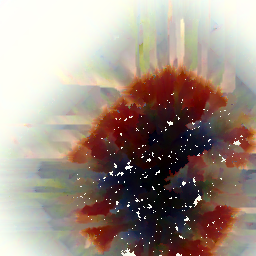

# Derivative (Current Version: 2.0)

The concept of this project was very simple; Take an image from the user and sort it in order to make an interesting derivative.

## What has been updated since version 1.0

Since creating the initial proof-of-concept, I have added a light user interface, so that users have some information for what is going on when they use Derivative. I have also added two additional sorting options for the users to choose from: Diamond and Bloom. I attempted to offload some of the image processing to a server using Socket.io, but decided to scrap that as an idea when the image processing took too long for the polling method used by Socket.io. The website is live and hosted on GitHub pages now, so please give it a try yourself: https://jessica-erickson.github.io/derivative/!

## How the initial proof-of-concept worked:

1. Take an image from the user, using `input type='file'` and the [File API](https://developer.mozilla.org/en-US/docs/Web/API/File/Using_files_from_web_applications).

2. Parse the image into a graph-like object, with the data of each pixel stored in a key of the x and y coordinates ('xCoordinate-yCoordinate').

3. Randomly choose a pixel to start and move its coordinates to the sorted array.

4. Push all of that pixel's adjacent pixels' coordinates into the frontier array.

5. Randomly select 500 pixels' coordinates from the remaining unsorted pixels.

6. Randomly select a frontier pixel, and find the buffer pixel with the closest color value to the frontier pixel's sorted neighbors.

7. Swap those pixels' rgba values, both on the canvas and in the image graph.

8. Move the frontier pixel's coordinates to the sorted array.

9. Push all of that pixel's adjacent pixels' coordinates into the frontier array.

10. Repeat steps 6 - 9, until the entire image is sorted (when there are no coordinates left in the unsorted pixel array).

Note: When a buffer pixel's coordinates are added to the frontier array, it is removed from the buffer array and replaced by another pixel's coordinates from the remaining unsorted pixels array, if there are any.

## Example Result of Version 1.0:

## Example Results of Version 2.0:

### The starting image:

### Sorted with Virus:

### Sorted with Diamond:

### Sorted with Bloom:

## Why did I make this?

I initially wanted to make Derivative to see if I could implement a generative pixel sort using the tools I am familiar with: HTML, JavaScript, and CSS. As I have tinkered with it, I have come to realize that this is more of an art installation than a website.

As programmers, we have the tremendous opportunity to apply technology to our lived experiences, whether that be making a pixel sorter or a charity donation form or a fun game or even an online storefront. People who don't yet know how to write code don't get to really experience this feeling of empowered curiosity. Derivative is my small answer to that.

By making this pixel sorter available to everyone, I hope that everyone who has a chance to use it can see the bizarre, yet wonderful, intersection of computers, math, art, and ownership that Derivative has come to be.

## Development notes:

Past Issue: "The main problem with my sorter, as it is, is that it gets bogged down for large images. To remedy that, I am looking at offloading the storage of that object to a server with an open channel to the frontend using websockets."

Resolution: I scrapped using Socket.io when I discovered the timeout problem for medium size images. Building out a straightforward API would probably be a viable solution for the large image problem, but I'm not sure. I will have to ask some people more experienced than me what they think.

Past Issue: "Another issue is that my means of calculating color similarity causes some unappealing pixel noise. To remedy that, I am going to change the color comparison from the averages of the rgba values to a value comparison of each color's hex codes."

Resolution: I have primarily solved the pixel noise problem by comparing the sum of differences between each pixel's rgba values, instead of using the average of each pixel's rgba values.

Past Issue: "I would also like to implement different sorting methods that the user can choose, so that they can see all of the potential ways of seeing art and using art."

Resolution: I have added two new sort methods: Diamond and Bloom. I think I might add some more as I think of them.

Past Issue: "Finally, I have a very sparse frontend. To remedy that, I am going to add some significant styling. I want this project to be a public facing tool that shows both the value in remixing art and a potential use of computer programming."

Resolution: I have added some light styling to the user interface, and improved the user experience. I would like to leave the minimal styling as it is, since it is currently unintrusive.

## Next steps:

I would like to submit Derivative, accompanied by a multitude of user-sorted images, as a work of art to a contest or maybe to the Denver Art Museum. I think a campaign similar to the Chainsmokers' "#Selfie" would be the most effective.

## Contributors:

Jessica Erickson: [GitHub](https://github.com/Jessica-Erickson), [LinkedIn](https://www.linkedin.com/in/j-m-erickson/), [Twitter](https://twitter.com/J_M_Erickson)
